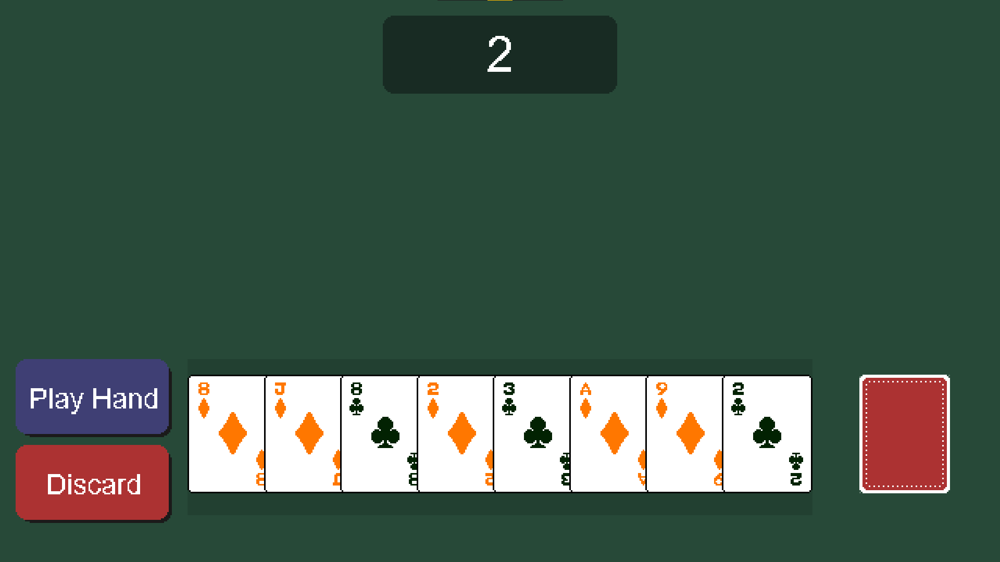
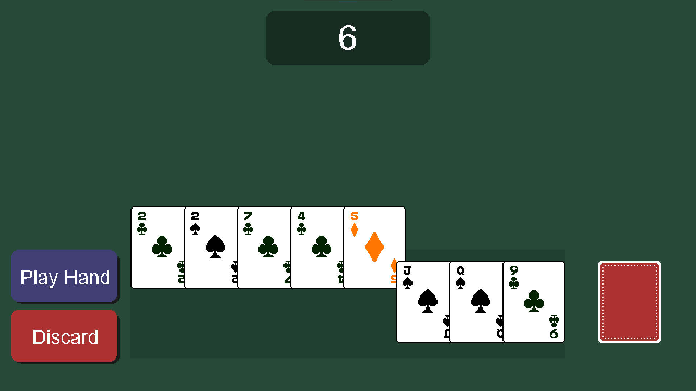

# CardGame2D

A 2D card game build with C++ and SDL3.

CardGame2D is a top-down 2D card game that supports poker-style scoring.
Players can select, play, and discard cards, with real-time scoring and
animations powered by SDL3.  

## Demo

## Tech Stack
- **Language:** C++
- **Framework:** SDL3
- **Build System:** CMake
- **Version Control:** Git/GitHub

## How to Play
To play just download the release zip and run CardGame2D.exe in the 
Release folder after extracting.
(Currently only Windows is supported)

